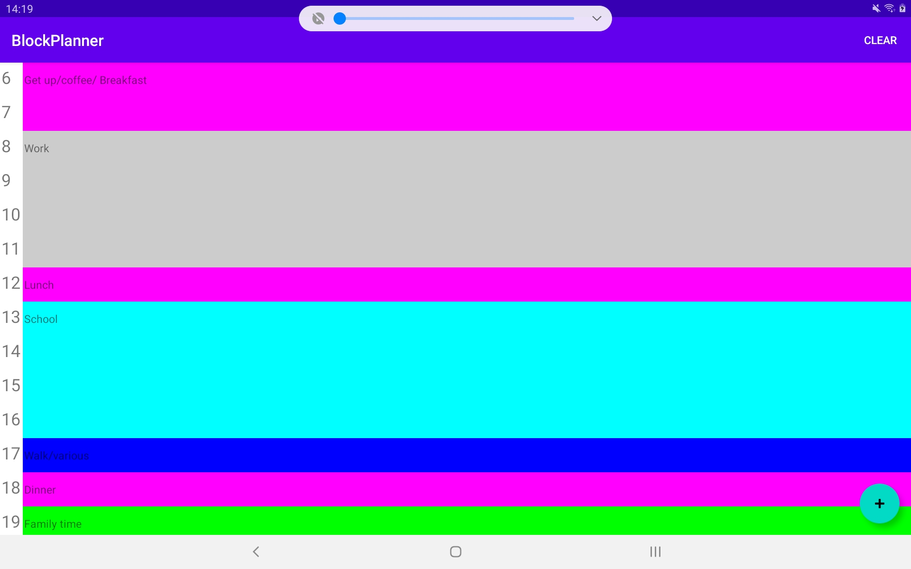

## Block Planner

This is a very simple Android app for planning your day using the block planning method. Here's a screenshot of it running on my tablet:

I originally created this because I wanted to move away from the paper daily planner (an old composition notebook...). And before you asked why in the world I didn't use the app store, the answer is that I really couldn't find anything to match what I needed. I found one, but the layout was weird. So I decided I could write something to meet my needs in one day, and I was write. I mean really, the design is simple.

I am planning on adding a second screen for writing any random things I might need... For example, in my notebook, I will generally write "work" or "school" down, then below write whatever parts of work or what school assignments I was going to do that day. Its fine at the moment, but this will bug me. I'm not planning on really doing much else after that except upgrading as needed. It doesn't store future days or do anything fancy, just be forewarned. Also, I have no idea if it looks good on anything except 10" tablets. I put it on Github so I can access it easily, and made it public in case someone finds it useful.

I likely won't be publishing this to the app store; I put an APK under releases, so download from there if you want to use. If you have any ideas, you can email me (see my website), but I won't promise I'll do anything. If you need a special feature, you might want to fork it. Its licensed under the BSD license so do what you want.
